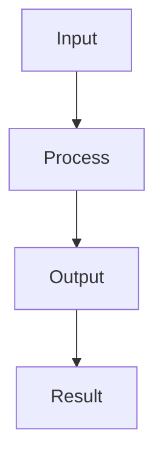

## Feature Description

[Clear and concise description of the feature.]

## Problem Statement

[What problem does this feature solve? Why is it needed?]

## Component

Which part of the project would this feature affect?

- [ ] `schema.json` — Schema validation
- [ ] `tools/validate.py` — Validator
- [ ] `tools/build.py` — Build script
- [ ] `tools/generate_dates.py` — Recurrence engine
- [ ] Python wrapper (`wrappers/python/`)
- [ ] JavaScript wrapper (`wrappers/javascript/`)
- [ ] TypeScript definitions (`wrappers/javascript/src/index.d.ts`)
- [ ] Go wrapper (`wrappers/go/`)
- [ ] Rust wrapper (`wrappers/rust/`)
- [ ] Tests (`tests/`)
- [ ] CI workflow (`.github/workflows/`)
- [ ] Documentation
- [ ] New exchange support
- [ ] New wrapper language: [specify]
- [ ] Other: [specify]

## Proposed Solution

[Describe how this feature should work. Be as specific as possible.]

### Design Overview



### API Changes

[Describe any API changes or additions.]

```python
# Example Python API
def new_function(param1: str, param2: int) -> bool:
    """New function description."""
    pass
```

```javascript
// Example JavaScript API
function newFunction(param1, param2) {
    // Implementation
}
```

```go
// Example Go API
func NewFunction(param1 string, param2 int) bool {
    // Implementation
}
```

```rust
// Example Rust API
pub fn new_function(param1: &str, param2: i32) -> bool {
    // Implementation
}
```

### JSON Schema Changes (if applicable)

```json
{
  "new_field": {
    "type": "string",
    "description": "Description of the new field",
    "examples": ["example_value"]
  }
}
```

## Alternatives Considered

[What alternatives have you considered? Why wasn't the chosen solution better?]

| Alternative | Pros | Cons |
|------------|------|------|
| Alternative 1 | [Pros] | [Cons] |
| Alternative 2 | [Pros] | [Cons] |
| **Proposed Solution** | [Pros] | [Cons] |

## Use Cases

[Provide concrete examples of how this feature would be used.]

### Use Case 1: [Name]

```bash
# Example usage
python tools/example.py --new-feature
```

### Use Case 2: [Name]

```python
# Example usage in Python
from exchange_calendar import new_feature
result = new_feature("param")
```

## Test Plan

[How should this feature be tested?]

```python
def test_new_feature(self):
    """Test the new feature."""
    # Test implementation
    pass
```

## Documentation Changes

[What documentation needs to be updated?]

- [ ] `README.md` — Add feature description
- [ ] `CHANGELOG.md` — Add feature entry
- [ ] `CONTRIBUTING.md` — Add contribution guidelines
- [ ] `docs/` — Add feature documentation
- [ ] API documentation
- [ ] Examples

## Migration Path

[If this is a breaking change, how should users migrate?]

```bash
# Migration steps
1. Update to latest version
2. Run migration script
3. Update code
```

## Compatibility

[How does this affect backward compatibility?]

- [ ] **Fully backward compatible**
- [ ] **Backward compatible with deprecation warnings**
- [ ] **Breaking change** — requires major version bump
- [ ] **New functionality** — no impact on existing code

## Implementation Estimate

[Provide an estimate if possible.]

| Task | Complexity | Estimated Time |
|------|-----------|----------------|
| Core implementation | [Low/Medium/High] | [Time] |
| Tests | [Low/Medium/High] | [Time] |
| Documentation | [Low/Medium/High] | [Time] |
| Review | [Low/Medium/High] | [Time] |
| **Total** | | **[Time]** |

## Dependencies

[Any dependencies or prerequisites?]

- [ ] No dependencies
- [ ] External library: [name]
- [ ] Schema change
- [ ] Other feature: [link]

## Priority

- [ ] **Critical** — blocking other work
- [ ] **High** — needed soon
- [ ] **Medium** — nice to have
- [ ] **Low** — future enhancement

## Community Impact

[How will this benefit the community?]

- [ ] Improves accuracy
- [ ] Improves performance
- [ ] Adds new functionality
- [ ] Fixes workflow
- [ ] Better documentation

## Additional Context

[Any other information, screenshots, or references.]

## Checklist

- [ ] I have searched existing issues for this feature
- [ ] I have described the problem this solves
- [ ] I have provided a proposed solution
- [ ] I have considered alternatives
- [ ] I have identified affected components
- [ ] I have considered testing and documentation

## Related Issues

- Related: #[issue]
- Blocks: #[issue]
- Blocked by: #[issue]
- Supersedes: #[issue]