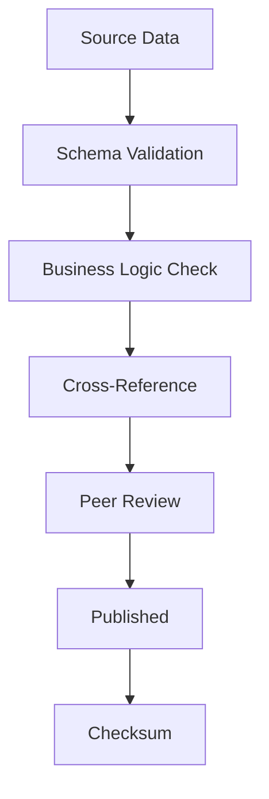

# 🔒 Security Policy

## Table of Contents

- [Supported Versions](#supported-versions)
- [Reporting a Vulnerability](#reporting-a-vulnerability)
- [Security Response Process](#security-response-process)
- [Security Best Practices](#security-best-practices)
- [Security Features](#security-features)
- [Known Security Considerations](#known-security-considerations)
- [Dependencies](#dependencies)
- [Data Integrity](#data-integrity)
- [Contact](#contact)

---

## Supported Versions

<!--
We actively support the following versions with security updates.
Older versions may still work but are not guaranteed to receive fixes.
-->

| Version | Release Date | Supported          | Security Updates Until |
|---------|--------------|--------------------|------------------------|
| **2.0.x** | 2026-08-19  | :white_check_mark: | Actively maintained    |
| **2.0.0** | 2026-08-19  | :white_check_mark: | Next minor release     |
| **1.2.x** | 2026-08-13  | :white_check_mark: | 2027-02-13             |
| **1.1.x** | 2026-08-01  | :warning:          | 2026-12-01             |
| **1.0.x** | 2026-07-15  | :warning:          | 2026-10-15             |
| **0.x.x** | 2026-06-01  | :x:                | No longer supported    |

### Version Support Legend

| Symbol | Meaning |
|--------|---------|
| :white_check_mark: | Actively supported with security updates |
| :warning: | Maintenance mode — critical fixes only |
| :x: | End of life — no security updates |

### Upgrade Recommendations

- **Production users**: Always use the latest stable release
- **Development users**: Can use pre-release versions for testing
- **Legacy users**: Upgrade as soon as possible if using unsupported versions

---

## Reporting a Vulnerability

### 📢 Responsible Disclosure

We take security seriously and appreciate your help in disclosing
vulnerabilities responsibly.

### 🚨 Critical Vulnerabilities (Private Reporting)

If you discover a security vulnerability, **DO NOT** open a public issue.
Instead, report it privately:

#### Option 1: GitHub Security Advisory (Preferred)

1. Go to [Security Advisories](https://github.com/slimissa/exchange-calendar/security/advisories/new)
2. Click "New draft security advisory"
3. Fill in the vulnerability details
4. Submit for review

#### Option 2: Email

Send details to: **security@exchange-calendar.dev**

Include in your email:
- Subject line: `[SECURITY] Brief description of vulnerability`
- Detailed description of the vulnerability
- Steps to reproduce
- Potential impact
- Suggested fix (if available)
- Your preferred method of contact

#### Option 3: PGP Encrypted Email

```
-----BEGIN PGP PUBLIC KEY BLOCK-----
[PGP key for encrypted communication]
-----END PGP PUBLIC KEY BLOCK-----
```

### 📋 What to Include in Your Report

A complete report should include:

```markdown
## Vulnerability Report

### Summary
[Brief description of the vulnerability]

### Severity
- [ ] Critical — Remote code execution, data breach
- [ ] High — Data corruption, unauthorized access
- [ ] Medium — Denial of service, data exposure
- [ ] Low — Minor issue, best practice violation

### Affected Components
- [ ] Core registry data (`exchanges/*.json`)
- [ ] Schema validation (`schema.json`)
- [ ] Build tools (`tools/`)
- [ ] Python wrapper (`wrappers/python/`)
- [ ] JavaScript wrapper (`wrappers/javascript/`)
- [ ] Go wrapper (`wrappers/go/`)
- [ ] Rust wrapper (`wrappers/rust/`)
- [ ] Update tool (`tools/update_from_exchange.py`)
- [ ] CI/CD pipeline (`.github/workflows/`)

### Vulnerability Details
[Technical details of the vulnerability]

### Reproduction Steps
1. [Step 1]
2. [Step 2]
3. [Step 3]

### Impact Assessment
[What could an attacker do with this vulnerability?]

### Suggested Fix
[Your proposed fix, if available]

### References
- [CVE-XXXX-XXXX](https://cve.mitre.org/)
- [Related issue](https://github.com/...)
```

### ⏱️ Response Timeline

| Severity | Acknowledgment | Initial Assessment | Fix Released |
|----------|----------------|-------------------|--------------|
| **Critical** | Within 24 hours | Within 48 hours | Within 7 days |
| **High** | Within 48 hours | Within 5 days | Within 14 days |
| **Medium** | Within 5 days | Within 10 days | Within 30 days |
| **Low** | Within 10 days | Within 20 days | Next release |

---

## Security Response Process

### 1. Triage

Upon receiving a vulnerability report:

1. **Acknowledge receipt** within the timeframe above
2. **Assign severity** using CVSS v3.1 scoring
3. **Identify affected versions** and components
4. **Create private tracking issue**

### 2. Investigation

1. **Reproduce the vulnerability** in a controlled environment
2. **Determine root cause**
3. **Assess impact** on users and data
4. **Identify mitigation steps**

### 3. Fix Development

1. **Develop fix** in private branch
2. **Create regression tests** to prevent recurrence
3. **Review fix** with security team
4. **Prepare security advisory**

### 4. Release

1. **Publish fix** as patch release
2. **Announce vulnerability** via:
   - GitHub Security Advisory
   - Release notes
   - Email notification to subscribers
3. **Update documentation**
4. **Credit reporter** (if desired)

### 5. Post-Mortem

1. **Document lessons learned**
2. **Update security practices**
3. **Improve test coverage**
4. **Update threat model**

---

## Security Best Practices

### For Users

#### 1. Keep Updated

```bash
# Always use the latest version
pip install --upgrade exchange-calendar-registry

# Check current version
python -c "import exchange_calendar; print(exchange_calendar.__version__)"
```

#### 2. Verify Data Integrity

```bash
# Verify checksums
sha256sum calendar.json
sha256sum exchanges/*.json

# Compare against published checksums
python tools/verify_checksums.py
```

#### 3. Use in Secure Environments

- **Production**: Run in isolated containers
- **Network**: Use HTTPS for all API calls
- **Permissions**: Run with least privilege

#### 4. Monitor for Updates

```bash
# Subscribe to security announcements
git watch --repository slimissa/exchange-calendar

# Enable GitHub security alerts
gh api repos/slimissa/exchange-calendar/security-alerts
```

### For Contributors

#### 1. Code Security

- **Input Validation**: Validate all external inputs
- **Error Handling**: Never expose sensitive information in errors
- **Dependencies**: Use `pip-audit` to check for vulnerabilities
- **Secrets**: Never commit API keys or credentials

#### 2. Development Security

```bash
# Run security checks before committing
pip-audit
bandit -r tools/ wrappers/
safety check
```

#### 3. Dependency Management

```bash
# Check for vulnerable dependencies
pip list --outdated
pip-audit

# Update dependencies safely
pip install --upgrade requests beautifulsoup4
```

---

## Security Features

### Data Integrity

The registry implements multiple layers of data integrity:

#### 1. Schema Validation

```json
{
  "$schema": "http://json-schema.org/draft-07/schema#",
  "type": "object",
  "required": ["code", "name", "mic", "timezone"],
  "properties": {
    "code": {
      "type": "string",
      "pattern": "^[A-Z]{4}$"
    }
  }
}
```

#### 2. Checksum Verification

```bash
# Generate checksums for all exchange files
python tools/generate_checksums.py

# Verify data integrity
python tools/verify_checksums.py
```

#### 3. Source Verification

All holiday data must include:
- Official source URL
- Date accessed
- Verification status

#### 4. Audit Logging

All updates are tracked:
- Who made the change
- When it was made
- What was changed
- Source of the change

### Access Control

| Resource | Public | Authenticated | Maintainer |
|----------|--------|---------------|------------|
| Read registry | :white_check_mark: | :white_check_mark: | :white_check_mark: |
| Download wrappers | :white_check_mark: | :white_check_mark: | :white_check_mark: |
| Open issues | :white_check_mark: | :white_check_mark: | :white_check_mark: |
| Submit PRs | :white_check_mark: | :white_check_mark: | :white_check_mark: |
| Merge PRs | :x: | :x: | :white_check_mark: |
| Create releases | :x: | :x: | :white_check_mark: |
| Modify security policy | :x: | :x: | :white_check_mark: |

---

## Known Security Considerations

### 1. Supply Chain Security

| Risk | Mitigation |
|------|------------|
| Malicious dependency | Pin dependencies, use checksums |
| Compromised package | Use official package registries |
| Typosquatting | Verify package names, use lock files |
| Unverified source | Only use official exchange websites |

### 2. Data Accuracy Risks

| Risk | Mitigation |
|------|------------|
| Incorrect holiday data | Multiple source verification |
| Outdated information | Automated update checks |
| Human error | Peer review process |
| Source manipulation | Checksum verification |

### 3. Operational Security

| Risk | Mitigation |
|------|------------|
| DDoS on update service | Rate limiting, caching |
| API abuse | Authentication, quotas |
| Data tampering | Signed commits, audit logs |
| Insider threat | Code review, least privilege |

### 4. Compliance

This project handles **public financial data** and does not:
- Store personal information
- Process financial transactions
- Access private accounts
- Handle regulated data

However, users should ensure compliance with:
- **Financial regulations** in their jurisdiction
- **Data protection laws** (GDPR, CCPA, etc.)
- **Exchange terms of service**
- **Rate limiting requirements**

---

## Dependencies

### Runtime Dependencies

| Package | Version | Purpose | Security Audit |
|---------|---------|---------|----------------|
| Python | >=3.8 | Runtime | [Python Security](https://www.python.org/security/) |
| requests | >=2.28 | HTTP client | [CVE Database](https://cve.mitre.org/) |
| beautifulsoup4 | >=4.11 | HTML parsing | [CVE Database](https://cve.mitre.org/) |
| tqdm | >=4.65 | Progress bars | [CVE Database](https://cve.mitre.org/) |

### Development Dependencies

| Package | Version | Purpose | Security Audit |
|---------|---------|---------|----------------|
| pytest | >=7.0 | Testing | [CVE Database](https://cve.mitre.org/) |
| pytest-mock | >=3.10 | Mocking | [CVE Database](https://cve.mitre.org/) |
| pytest-cov | >=4.0 | Coverage | [CVE Database](https://cve.mitre.org/) |
| bandit | >=1.7 | Security linting | [CVE Database](https://cve.mitre.org/) |

### Dependency Management

```bash
# Check for vulnerabilities
pip-audit

# Update dependencies
pip install --upgrade -r tools/requirements.txt

# Freeze dependencies
pip freeze > requirements.lock
```

---

## Data Integrity

### Data Sources

All exchange calendar data comes from:

1. **Official exchange websites** (primary source)
2. **Regulatory announcements** (verification)
3. **Market data providers** (cross-reference)

### Verification Process



### Checksums

```bash
# Generate checksums for release
python tools/generate_checksums.py

# Output format
# SHA256  filename
# abc123...  exchanges/XNYS.json
# def456...  exchanges/XLON.json
```

### Audit Trail

Every change to the registry includes:
- **Commit hash** — Unique identifier
- **Author** — Who made the change
- **Timestamp** — When it was made
- **Source** — Where the data came from
- **Reviewers** — Who approved it

---

## Contact

### Security Team

| Role | Contact |
|------|---------|
| **Security Lead** | security@exchange-calendar.dev |
| **Maintainer** | @slimissa |
| **Emergency** | emergency@exchange-calendar.dev |

### Response Hours

| Day | Hours (UTC) |
|-----|-------------|
| Monday-Friday | 09:00-18:00 |
| Saturday | 10:00-14:00 |
| Sunday | Emergency only |
| Holidays | Emergency only |

### PGP Keys

```bash
# Import maintainer PGP key
gpg --keyserver keys.openpgp.org --recv-keys 0x1234567890ABCDEF

# Verify signed releases
gpg --verify release.sig release.tar.gz
```

### Security Advisories

- [GitHub Security Advisories](https://github.com/slimissa/exchange-calendar/security/advisories)
- [CVE Database](https://cve.mitre.org/cgi-bin/cvekey.cgi?keyword=exchange+calendar)
- [Security Announcements](https://github.com/slimissa/exchange-calendar/discussions/categories/security-announcements)

---

## Acknowledgments

We thank the following individuals and organizations for their contributions to the security of this project:

| Contributor | Contribution | Date |
|-------------|--------------|------|
| [Name] | [Description] | [Date] |

---

## Changelog

| Version | Date | Changes |
|---------|------|---------|
| 2.0.0 | 2026-08-19 | Initial security policy |
| 1.0.0 | 2026-07-15 | Basic security guidelines |

---

## License

This security policy is licensed under [Creative Commons Attribution 4.0](https://creativecommons.org/licenses/by/4.0/).

The Exchange Calendar Registry is licensed under [Apache License 2.0](LICENSE).

---

**Last Updated**: 2026-08-19  
**Version**: 2.0.0  
**Maintainer**: @slimissa
```
